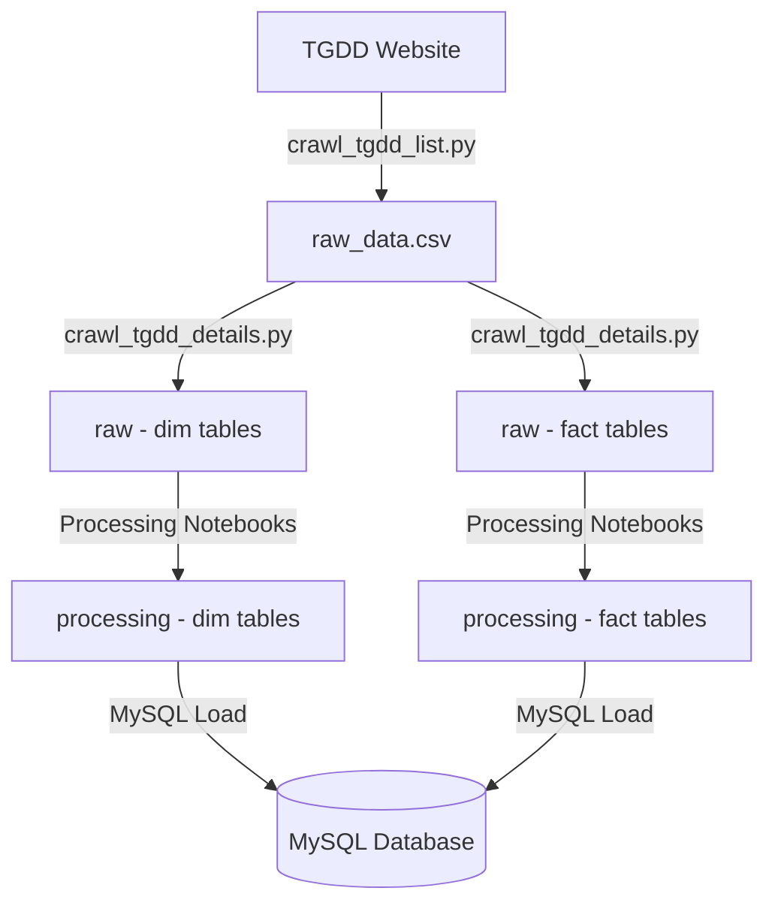
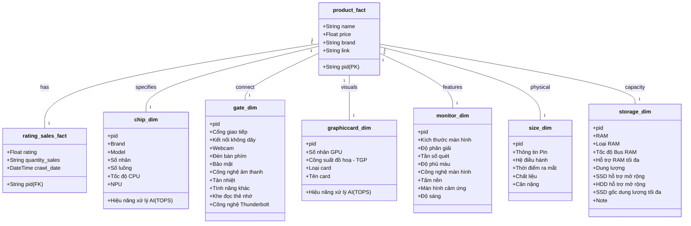

# TGDD Laptop ETL Pipeline (Crawling & Processing)

Dự án xây dựng hệ thống tự động hóa thu thập (Crawling), xử lý (Cleaning) và lưu trữ dữ liệu Laptop từ Thế Giới Di Động (TGDD) theo mô hình Data Warehouse (Fact/Dimension).

---

## Mục lục 
1. [Tổng quan dự án](#tổng-quan-dự-án)
2. [Cấu trúc thư mục](#cấu-trúc-thư-mục)
3. [Luồng dữ liệu (Data Flow)](#luồng-dữ-liệu-data-flow)
4. [Kiến trúc dữ liệu (Schema & UML)](#kiến-trúc-dữ-liệu-schema--uml)
5. [Tính năng nổi bật](#tính-năng-nổi-bật)
6. [Hướng dẫn cài đặt & Vận hành](#hướng-dẫn-cài-đặt--vận-hành)
7. [Bài học kinh nghiệm (Key Learnings)](#bài-học-kinh-nghiệm-key-learnings)
8. [Hướng phát triển](#hướng-phát-triển)

---

## Tổng quan dự án
Dự án thực hiện quy trình ETL hoàn chỉnh:
- **Extract:** Sử dụng Selenium giả lập trình duyệt để lấy dữ liệu động, vượt qua các rào cản về JavaScript và Lazy Loading.
- **Transform:** Chuẩn hóa dữ liệu thô (Raw) sang dữ liệu sạch (Processed) thông qua các Pipeline xử lý chuyên biệt cho từng nhóm thông số.
- **Load:** Lưu trữ dữ liệu vào MySQL (Dockerized) để phục vụ cho phân tích lâu dài.

---

## Cấu trúc thư mục
```text
/home/hp/crawling-data/
├── databases/                      # Quản lý Docker & MySQL
│   ├── docker-compose.yml          # MySQL 8.0.36 configuration
│   └── .env                        # Database credentials
├── notebooks/                      # Mã nguồn xử lý
│   ├── crawling/                   # Scripts cào dữ liệu (.py & .ipynb)
│   │   ├── crawl_tgdd_list.py      # Cào danh sách sản phẩm (Master List)
│   │   └── crawl_tgdd_details.py   # Cào chi tiết specs (Checkpoint-enabled)
│   └── processing/                 # Notebooks làm sạch dữ liệu
│       ├── chip_clean.ipynb
│       ├── Monitor_clean.ipynb
│       └── utils.py
├── data/                           # Quản lý dữ liệu
│   ├── raw/                        # Dữ liệu thô (định dạng Dim/Fact)
│   └── processing/                 # Dữ liệu đã làm sạch
├── logs/                           # Nhật ký vận hành & Checkpoints
├── drivers/                        # Quản lý WebDriver (Automated)
├── README.md
└── requirements.txt                # Thư viện cần thiết
```

---

## Luồng dữ liệu (Data Flow)


---

## Kiến trúc dữ liệu (Schema & UML)

### Data Schema
Dữ liệu được tổ chức theo mô hình **Star Schema** tối giản:
- **Fact Tables:** 
    - `raw_data`: Chứa thông tin giá, link, brand.
    - `rating_sales`: Chứa chỉ số đánh giá và doanh số theo thời gian.
- **Dimension Tables:** Các bảng thuộc tính kỹ thuật (`cpu`, `ram_storage`, `monitor`, `gpu`, `physical`).

### UML Data Diagram


---

## Tính năng nổi bật
1.  **Checkpoint System:** Script cào chi tiết có khả năng ghi nhớ những sản phẩm đã cào thành công. Nếu xảy ra lỗi mạng/mất điện, hệ thống sẽ tự động cào tiếp từ vị trí dừng lại.
2.  **WebDriver Auto-Management:** Tích hợp `webdriver-manager` để tự động hóa việc cài đặt driver tương thích với phiên bản trình duyệt hiện tại.
3.  **Smart Batch Processing:** Tự động reset trình duyệt sau mỗi 20 sản phẩm để giải phóng bộ nhớ RAM, tránh treo trình duyệt khi chạy lâu.
4.  **Logging & Error Tracking:** Hệ thống log chi tiết lưu trữ tại `logs/` giúp theo dõi tiến độ và xử lý lỗi nhanh chóng.
5.  **Dockerized DB:** Triển khai MySQL nhanh chóng qua Docker Compose với phiên bản ổn định (pin version 8.0.36).

---

## Hướng dẫn cài đặt & Vận hành

### 1. Chuẩn bị môi trường
```bash
pip install -r requirements.txt
```

### 2. Khởi động Database
```bash
cd databases
docker-compose up -d
```

### 3. Thu thập dữ liệu
- Chạy script lấy danh sách sản phẩm:
  ```bash
  python notebooks/crawling/crawl_tgdd_list.py
  ```
- Chạy script lấy chi tiết thông số (Checkpoint-enabled):
  ```bash
  python notebooks/crawling/crawl_tgdd_details.py
  ```

---

## Bài học kinh nghiệm (Key Learnings)
- **Xử lý Dynamic Content:** Selenium là lựa chọn bắt buộc cho các trang Ecommerce hiện đại dùng Lazy Load, nhưng cần kết hợp với `WebDriverWait` thay vì `sleep` để tối ưu thời gian.
- **Quản lý RAM:** Việc mở hàng trăm Tab/Link liên tục sẽ gây tràn bộ nhớ; giải pháp là reset instance WebDriver theo định kỳ.
- **Data Integrity:** Việc sử dụng PID làm khóa chính (Primary Key) xuyên suốt từ lúc cào đến lúc lưu DB là yếu tố sống còn để đảm bảo dữ liệu không bị sai lệch khi Join các bảng.
- **Automation Ready:** Việc chuyển đổi từ Notebook sang Script (`.py`) là bước đệm cần thiết để áp dụng các công cụ điều phối như Airflow hoặc Prefect.

---

## Hướng phát triển
- [ ] viết script `Load_dim.py` và `Load_fact.py` để load dữ liệu vào MySQL/PostgresSQL.
- [ ] sử dụng dbt (data build tool) tiếp tục xử lý ELT bên trong DWH này.
- [ ] Triển khai **Prefect** để lập lịch chạy cào dữ liệu hàng 
tuần.
- [ ] Áp dụng Multi-threading để tăng tốc độ cào chi tiết sản phẩm.

---
*Cập nhật lần cuối: 20/03/2026*

*Data được crawl lần cuối vào tầm giữa tháng 9/2025, cấu trúc trang web có thể thay đổi, nên check lại chính xác nhé*
