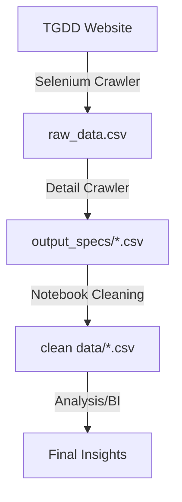

# crawling-data

Dự án thu thập và xử lý dữ liệu laptop từ Thế Giới Di Động (tgdd.vn) sử dụng Python và Selenium.

## 1. Mục đích Project
Dự án được xây dựng để thực hiện quy trình ETL (Extract, Transform, Load) dữ liệu Laptop. Dữ liệu bao gồm thông tin cơ bản, thông số kỹ thuật chi tiết và các chỉ số đánh giá sản phẩm, phục vụ cho mục tiêu phân tích thị trường và xây dựng hệ thống hỗ trợ quyết định.

## 2. Cấu trúc thư mục
- `crawling data from tgdd.ipynb`: Script thu thập danh sách sản phẩm và URL chi tiết.
- `crawling specs & rating.ipynb`: Script thu thập thông số kỹ thuật chi tiết từ từng sản phẩm.
- `raw_data.csv`: Kết quả thô của danh mục sản phẩm.
- `output_specs/`: Thư mục chứa các file CSV thô được phân loại theo nhóm thuộc tính (CPU, RAM, Màn hình...).
- `notebook/`: Các Jupyter Notebook thực hiện việc làm sạch và chuẩn hóa dữ liệu (Cleaning).
- `clean data/`: Kết quả cuối cùng là dữ liệu sạch sẵn sàng để phân tích.
- `notebook/utils.py`: Các hàm hỗ trợ xử lý dữ liệu dùng chung.

## 3. Tại sao sử dụng Selenium?
- **Dynamic Content:** Website sử dụng cơ chế Lazy Loading và Infinite Scroll, yêu cầu trình duyệt thực thi JavaScript để hiển thị đầy đủ danh sách.
- **Interactivity:** Một số thông số kỹ thuật nằm trong các phần cần tương tác (Click "Xem thêm") mới có thể truy cập được.
- **Bypass Anti-Crawl:** Selenium giả lập hành vi người dùng thực, giúp hạn chế việc bị chặn bởi các cơ chế bảo vệ của website.

## 4. Schema Data
Dữ liệu được liên kết thông qua khóa chính `pid` (Product ID):
- **Thông tin cơ bản:** `pid`, `link`, `name`, `price`, `brand`.
- **Thông số kỹ thuật:** Chia thành các bảng CPU, RAM & Storage, Screen, GPU, Cổng kết nối, Kích thước & Pin.
- **Rating & Sales:** `pid`, điểm đánh giá, số lượt đánh giá, ước tính doanh số.

## 5. Data Flow


## 6. Hướng phát triển & Điều phối (Orchestration)
- **Airflow:** Phù hợp nếu mở rộng quy mô lớn, nhiều nguồn dữ liệu (Scraping Framework). Airflow giúp quản lý Dependency giữa việc cào và việc làm sạch dữ liệu rất tốt.
- **Prefect:** Một lựa chọn hiện đại, nhẹ nhàng và Pythonic hơn Airflow, phù hợp để triển khai nhanh các pipeline dữ liệu.
- **Cron Job:** Chỉ nên dùng nếu quy trình đơn giản và ổn định trên một máy đơn lẻ.
- **Nâng cấp:** Chuyển đổi lưu trữ từ file CSV sang SQL Database (PostgreSQL) để tối ưu truy vấn.

## 7. Những việc chưa làm tốt
- **Tốc độ:** Thời gian cào còn dài (~1.5h). Cần triển khai Multiprocessing/Async để tối ưu.
- **Xử lý lỗi:** Cơ chế Retry khi gặp lỗi mạng hoặc lỗi element chưa tải kịp còn hạn chế.
- **Cấu hình:** Các đường dẫn WebDriver còn đang fix cứng, cần đưa vào biến môi trường hoặc file config.

## 8. Cách cấu hình dự án
1. Cài đặt Python 3.10+.
2. Cài đặt dependencies: `pip install selenium pandas numpy jupyter`.
3. Tải **Edge WebDriver** (hoặc Chrome) tương ứng với phiên bản trình duyệt.
4. Cập nhật đường dẫn WebDriver trong biến `service` tại các notebook:
   ```python
   service = Service(r"đường/dẫn/đến/webdriver.exe")
   ```
5. Chạy tuần tự các notebook từ thu thập đến làm sạch.

---
*Cập nhật lần cuối: 20/03/2026*
